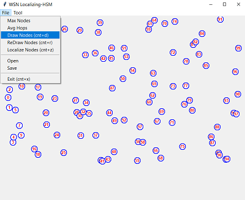

# WSN_Localizer

We assume a certain number of WSN nodes, say N, are placed randomly in a plain so that each node has at least a few say M minimum neighboring nodes within its transmitting range.
We assume that each node participates in a localization procedure (algorithm) at regular intervals to generate a list of all nodes N with their node-no, location information x and y using received signal strengths.

Figure-1 Simulation of a Wireless Sensor Network (WSN) with interactive GUI to demonstrate a new Localization algorithm. 

This Algorithm is used for a Novel Energy Efficient Routing Algorithm https://github.com/hsmazumdar/WSN_Router/tree/main . Initially populate selected number of nodes, with random placement on canvas using 'File' menu of by simply pressing (Cnt+d)

Quick Start Steps:

1. Download the zip file and unzip in a folder ‘WSN_Localizer’.
2. Select ‘WsnLocalize.py’ file and load in VS Code
3. Install necessary library components in VC Code
4. Run 'WsnLocalize.py' to popup 'WSN Localizing' application of figure-1
5. Open 'File' menu tab and press 'Draw Nodes (Cnt+d)' tab or press 'Control + d' to populate randomly distributed nodes as shown in figure-1. The default number of nodes are 100 and can be changed using ‘Max Nodes’ tab
6. Press 'File->Localize' tab or press Cnt+z to localize all nodes as shown in figure-2
7. Press 'File->Save' tab to open save file dialog box, select save file path and enter save file name. Press 'Save' button to save localize list of nodes as follows.
   
LocalizeHsm.txt,100  =>File Name, Number of nodes
0,16,257,100,0       =>Serial no, x, y, state  
1,20,290,100,0
2,21,231,100,0
.........

Figure-2 Simulation demonstrates WSN nodes Localization from initial three nodes of known coordinates connected using red lines. 
